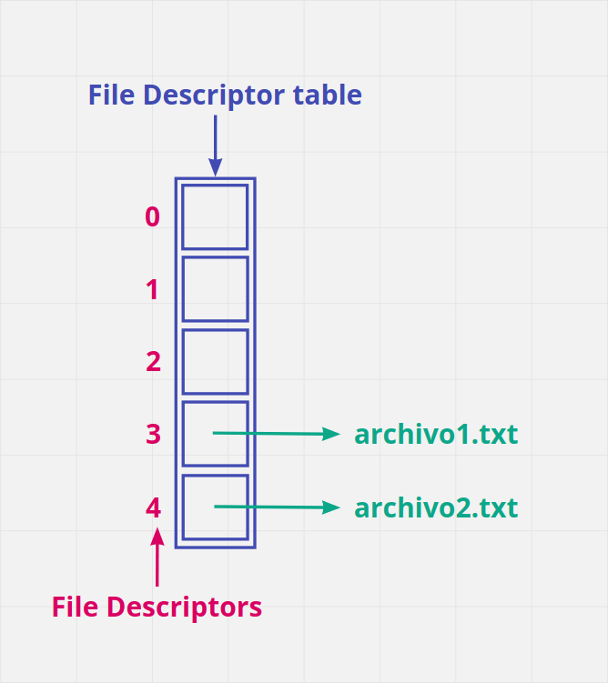

# C File System

## Manejo de ficheros en C. Funciones open, close, creat, read y write

---

<aside>
💡 Antes de empezar, la explicación que se va a dar a continuación va a ser superficial y orientada a personas que, como yo, se estén iniciando en el manejo de estas funciones.

Aunque he intentado que no suceda, estos apuntes pueden tener imprecisiones o incluso erratas por lo que ante la duda, recomiendo consultar fuentas más fiables. 

Gracias. 🙂

</aside>

### Conceptos previos

Antes de empezar con las funciones de manejo de archivos, es necesario hacer una breve introducción sobre como trabaja nuestro sistema operativo con los archivos.

Cuando nuestro sistema inicia un proceso, le asigna lo que se conoce como una *File Descritor table, p*ero ¿esto qué es? **Pues en esencia es un array en el que se almacenan punteros hacia los archivos abiertos. Como todo buen array,  tiene sus índices que en este caso se denominan *File Descriptors (fd)* y que utilizamos para hacer referencia al archivo dentro de nuestro programa. 



A cada archivo abierto se le asigna un *File Descriptor* distinto como muestra la imagen anterior. 

Como podrás observar, el primer *fd* que he asignado es el 3 (cuarto *fd* ya que empezamos en el 0), y esto tiene su razón de ser. Los 3 primeros ya están asignados por defecto y son los denominados *Standard File Descriptors.* Estos tres hacen referencia a un archivo llamado /dev/tty y corresponden con la entrada, la salida y los errores respectivamente.

- Entrada ⇒ *fd* 0: cuando escribimos un carácter desde el teclado, nuestro sistema lo lee desde stdin (standard input) a traves del *fd* 0 y lo guarda en el archivo /dev/tty.
- Salida ⇒ *fd* 1: cuando vemos una respuesta por pantalla, esta proviene del archivo /dev/tty  y se escrive en stdout (standard output) a traves del *fd* 1.
- Errores ⇒ *fd* 2: siempre que nos aparece un error a la hora de ejecutar un programa, este proviene también de este archivo y se muestra por pantalla a través del *fd* 2.


Una vez conocemos esto, ya podemos pasar a las funciones de manejo de archivos.

### Funciones open, close, creat, read y write

- **Creat**: se utiliza para crear un archivo vacío.
    
    Sintaxis: 
    
    ```c
    #include <sys/types.h>
    #include <sys/stat.h>
    #include <fcntl.h>
    
    int creat(const char *pathname, mode_t mode);
    ```
    
    Parámetros: 
    
    - pathname: ruta del archivo a crear incluyendo el nombre del propio archivo.
    - mode: indica los permisos que le queremos asignar al nuevo archivo.
        
        Este parámetro puede tomar distintos valores dependiendo de a quién y qué permisos queramos darle. Para ver todos los posibles valores te recomiendo que veas la página del manual de la propia función (para acceder a ella en linux utilizamos el comando "man creat" ).
        
        Algún ejemplo de los valores que puede tomar: 
        
        - "S_IWUSR" o "00700" ⇒ El usuario recibe permisos de lectura, escritura y ejecución.
            
            (A la hora de escribir los parámetros se realiza sin las comillas)
            
        - "S_IRUSR" o "00400" ⇒ El usuario recibe permisos de de lectura.
        - "S_IXGRP" o "00010" ⇒ El grupo recibe permisos de ejecución.
        - ...
        
        <aside>
        💡 Antes de continuar, en estas funciones en las que hay que indicar flags y mode, es bastante habitual querer indicar varios de ellos. Para esto los separamos mediante la barra vertical ( | )
        
        </aside>
        
    
    Devuelve: 
    
    - Devuelve el primer *fd* libre que encuentre y que servirá para indentificar al fichero en nuestro programa (como ya hemos visto anteriormente el primero libre siempre va a ser el 3 ya que los anteriores están reservados).
    - Devuelve -1 si encuentra algún error.

- **Open:** se emplea para abrir el archivo y posteriormente poder leerlo, escribir en él o hacer ambas. Con las flags adecuadas también puede usarse para crear un archivo nuevo.
    
    Sintaxis: 
    
    ```c
    #include <sys/types.h>
    #include <sys/stat.h>
    #include <fcntl.h>
    
    int open(const char *pathname, int flags[, mode_t mode]);
    ```
    
    Parámetros:
    
    - pathname: ruta al archivo que queramos abrir.
    - flags: indican cómo queremos abrir el archivo.
        
        Flags más utilizadas: 
        
        - O_RDONLY: solo lectura.
        - O_WRONLY: solo escritura.
        - O_RDWR: lectura y escritura.
        - O_CREAT: crea un archivo si no existe.
        - O_EXCL: previene la creación de un archivo si ya existe.
        - ...
    - mode: es el mismo parámetro que el de la función creat. Solamente hace falta especificarlo si se utiliza open para crear un archivo.
    
    <aside>
    💡 La función creat es equivalente a llamar a la función open con los flags:
    
    O_CREAT | O_WRONLY | O_TRUNC
    
    </aside>
    
    Devuelve: 
    
    - El file descriptor del archivo abierto o creado.
    - -1 en caso de error.

- **Close**: se encarga de cerrar el fichero al que apunta el *fd* que le indicamos como parámetro
    
    Sintaxis:
    
    ```c
    #include <unistd.h>
    
    int close(int fd);
    ```
    
    Parámetros: 
    
    - fd: *File Descriptor* del archivo a cerrar
    
    Devuelve: 
    
    - 0 si el archivo se cierra correctamente
    - -1 si ocurre algún error
- **Read**:  intenta leer un número determinado (count) de bytes del archivo abierto al que hace referencia el *File Descriptor* (fd) pasado como parámetro y lo guarda en el buffer al que señala buf.
    
    Sintaxis:
    
    ```c
    #include <unistd.h>
    
    ssize_t read(int fd, void *buf, size_t count);
    ```
    
    Parámetros:
    
    - fd: *File Descriptor* correspondiente al archivo abierto que queremos leer.
    - buf: espacio de memoria donde se guarda el contenido del archivo que leemos.
    - count: número de bytes que queremos leer.
    
    Devuelve:
    
    - Número de bytes leídos.
    - 0 si se alcanza el final del archivo.
    - -1 si hay algún error.
    
    <aside>
    💡 NOTA: Es importante que el parámetro count no sobrepase el tamaño del buffer (buf) ya que se produciría un desbordamiento de memoria.
    
    </aside>
    

- **Write:** escribe hasta un número *count* de bytes del buffer que empieza en *buf* en el archivo asociado a *fd*.
    
    Sintaxis:
    
    ```c
    #include <unistd.h>
    
    ssize_t write(int fd, const void *buf, size_t count);
    ```
    
    Parámetros:
    
    - fd: *File Descriptor* correspondiente al archivo previamente abierto.
    - buf: buffer de al menos count bytes que será escrito en el archivo.
    - count: número de bytes que queremos escribir.
    
    Devuelve:
    
    - El número de bytes escritos.
    - 0  si se alcanza el final del archivo.
    - -1 si hay algún error.
